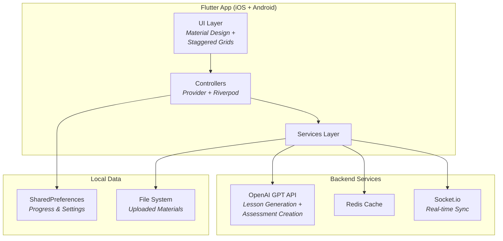

# Stevo — AI-Powered Adaptive Learning Platform

A cross-platform mobile app that uses GPT to transform any content into personalized, student-tailored lessons and assessments. Upload material or describe a topic → the AI structures it into guided learning paths with quizzes that adapt to your level. Built with Flutter for iOS and Android.


## The Problem

Students spend hours distilling dense material into something learnable. Traditional study tools give everyone the same static content, regardless of what they already know. There's no feedback loop — you can't tell if you're actually learning until the exam.

## What It Does

- **Content-to-Lesson Pipeline** — Upload PDFs, paste text, or describe a topic. GPT generates structured lessons broken into digestible sections tailored to the student's level.
- **Adaptive Assessments** — AI-generated quizzes that adjust difficulty based on your responses. Get questions wrong → the system drills down. Get them right → it moves on.
- **Real-Time Sync** — Socket.io integration for live data synchronization across sessions and devices.
- **Progress Analytics** — Track completion, performance trends, and time spent across topics with interactive charts (FL Chart).
- **OTP Verification** — Secure account verification with one-time password input (Pinput).
- **Cross-Platform** — Single Flutter codebase targeting both iOS and Android.

## Architecture



## Technical Highlights

- **AI Lesson Generation** — The OpenAI integration doesn't just summarize content. It structures material into a learning sequence: introduction → core concepts → examples → practice questions, adapting complexity based on the student's prior performance.
- **Real-Time with Socket.io** — Live data synchronization enables features like collaborative study sessions and instant progress updates across devices.
- **Redis Caching** — Frequently accessed lesson content and user progress data is cached in Redis to minimize API calls and reduce latency.
- **State Management** — Dual Provider + Riverpod setup. Provider handles simple app-wide state (auth, theme), while Riverpod manages complex async state (lesson loading, quiz progress) with compile-time safety.
- **Custom Loading Animations** — Custom `LoaderOverlay` with animated Stevo branding for a polished feel during API calls.

## Tech Stack

| Layer | Technology |
|-------|-----------|
| Framework | Flutter 3, Dart |
| AI | OpenAI GPT API |
| State | Provider + Riverpod |
| Real-Time | Socket.io |
| Cache | Redis |
| Navigation | AutoRoute |
| Charts | FL Chart, Timelines |
| Storage | SharedPreferences |
| Auth | OTP verification (Pinput) |
| UI | Material Design, Staggered Grid View |

## Running Locally

```bash
git clone https://github.com/thisisyoussef/stevo_flutter.git
cd stevo_flutter
flutter pub get
flutter run
```

Configure your OpenAI API key and backend URL in the services layer.

## Project Structure

```
lib/
├── controllers/        # Business logic (Provider/Riverpod)
├── models/             # Data models (lessons, assessments, users)
├── screens/            # UI pages (home, lesson, quiz, analytics)
├── services/           # API clients (OpenAI, Socket.io, Redis)
├── data/               # Local data persistence
├── widgets/            # Reusable components (cards, loaders, charts)
├── utils/              # Helpers and formatters
├── router.dart         # AutoRoute navigation config
└── main.dart           # App entry with MultiProvider setup
```
